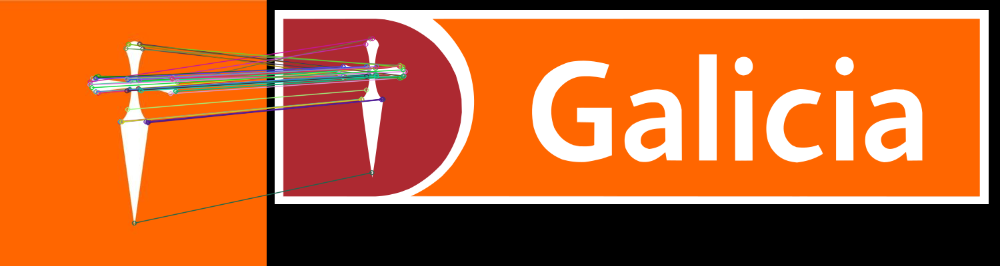

# Fraud Detection

Detecta si un perfil en redes sociales es fraudulento. 

**URL** : `/fraud/`

**Method** : `GET`

**Auth required** : No

**Permissions required** : None

## Success Response

**Code** : `200 OK`

**Content examples**

***Input***

```json
ejemplo = {"contributors_enabled": False,
"created_at": "Wed Jun 12 15:01:14 +0000 2019",
"default_profile": True,
"default_profile_image": False,
"description": "Cuenta oficial de Banco Galicia. Atencion las 24hs",
"entities": {"description": {"urls": []}},
"favourites_count": 5252,
"follow_request_sent": False,
"followers_count": 146,
"following": False,
"friends_count": 235,
"geo_enabled": True,
"has_extended_profile": True,
"id": 1138823579984957442,
"id_str": "1138823579984957442",
"is_translation_enabled": False,
"is_translator": False,
"lang": None,
"listed_count": 0,
"location": "Argentina🇦🇷🙋🏻\u200d♀️",
"name": "BancoGalicia",
"notifications": False,
"profile_background_color": "F5F8FA",
"profile_background_image_url": None,
"profile_background_image_url_https": None,
"profile_background_tile": False,
"profile_banner_url": "https://pbs.twimg.com/profile_banners/1138823579984957442/1573072688",
"profile_image_url": "http://pbs.twimg.com/profile_images/1192179946778697728/VrBnnkMZ_normal.jpg",
"profile_image_url_https": "https://pbs.twimg.com/profile_images/1192179946778697728/VrBnnkMZ_normal.jpg",
"profile_link_color": "1DA1F2",
"profile_sidebar_border_color": "C0DEED",
"profile_sidebar_fill_color": "DDEEF6",
"profile_text_color": "333333",
"profile_use_background_image": True,
"protected": False,
"screen_name": "bancogalicia19",
"statuses_count": 3605,
"time_zone": None,
"translator_type": "none",
"url": None,
"utc_offset": None,
"verified": False}
```

`parametros = {"source": "Twitter", "user_info": json.dumps(ejemplo)}`

***Output***

```json
{
   "is_fraud": False,
   "match": None
}
```

Para el match por ```"imagen"``` se usa técnicas de computer vision capaces de detectar similaridades entre dos imagenes usando [ORB Features](https://medium.com/data-breach/introduction-to-orb-oriented-fast-and-rotated-brief-4220e8ec40cf)

Ejemplo:


